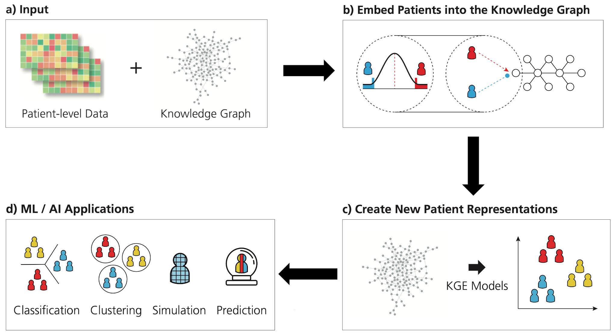

<p align="center">
  
</p>

<h1 align="center">
  CLEP: A Hybrid Data- and Knowledge- Driven Framework for Generating Patient Representations
  <br/>
  <a href='https://travis-ci.com/github/hybrid-kg'>
     
  </a>
  <a href='https://clep.readthedocs.io/en/latest/?badge=latest'>
    
  </a>
  <a href="https://zenodo.org/badge/latestdoi/209278408">
    
  </a>
  <a href="https://pypi.org/project/clep/">
    
  </a>
  
  <a href="https://github.com/hybrid-kg/clep/blob/master/LICENSE">
    
  </a>
</h1>

## Table of Contents

- [Table of Contents](#table-of-contents)
- [General Info](#general-info)
- [Installation](#installation)
- [Documentation](#documentation)
- [Input Data Formats](#input-data-formats)
  - [Data](#data)
  - [Design](#design)
  - [Knowledge Graph](#knowledge-graph)
- [Usage](#usage)
- [Issues](#issues)
- [Acknowledgements](#acknowledgements)
  - [Citation](#citation)
  - [Graphics](#graphics)
- [Disclaimer](#disclaimer)

## General Info

CLEP is a framework that contains novel methods for generating patient representations from any patient level data and its corresponding prior knowledge encoded in a knowledge graph. The framework is depicted in the graphic below

<p align="center">
  
</p>

## Installation

**NOTE**: The installation of CLEP **requires** R to be installed on your system along with limma package for R. R can be downloaded from [CRAN](https://cran.r-project.org/). The limma package can be installed in R with the following command:

```R
if (!require("BiocManager", quietly = TRUE))
    install.packages("BiocManager")

BiocManager::install("limma")
```

The code can be installed from [PyPI](https://pypi.org/project/clep/) with:

```bash
$ pip install clep
```

The most recent code can be installed from the source on [GitHub](https://github.com/hybrid-kg/clep) with:

```bash
$ pip install git+https://github.com/hybrid-kg/clep.git
```

For developers, the repository can be cloned from [GitHub](https://github.com/hybrid-kg/clep) and installed in editable mode with:

```bash
$ git clone https://github.com/hybrid-kg/clep.git
$ cd clep
$ pip install -e .
```

## Documentation

Read the [official docs](https://clep.readthedocs.io/en/latest/) for more information.

## Input Data Formats

### Data

| Symbol    | Sample_1 | Sample_2 | Sample_3 |
| --------- | -------- | -------- | -------- |
| HGNC_ID_1 | 0.354    | 2.568    | 1.564    |
| HGNC_ID_2 | 1.255    | 1.232    | 0.26452  |
| HGNC_ID_3 | 3.256    | 1.5      | 1.5462   |

**Note:** The data must be in a tab separated file format.

### Design

| FileName | Target   |
| -------- | -------- |
| Sample_1 | Abnormal |
| Sample_2 | Abnormal |
| Sample_3 | Control  |

**Note:** The data must be in a tab separated file format.

### Knowledge Graph

The graph format CLEP can handle is a modified version of the Edge List Format. Which looks as follows:

| Source    | Relation    | Target    |
| --------- | ----------- | --------- |
| HGNC_ID_1 | association | HGNC_ID_2 |
| HGNC_ID_2 | decreases   | HGNC_ID_3 |
| HGNC_ID_3 | increases   | HGNC_ID_1 |
    
**Note:** The data must be in a tab separated file format & if your knowledge graph does not have relations between the source and the target, just populate the relation column with "No Relation".


## Usage

**Note:** These are very basic commands for clep, and the detailed options for each command can be found in the [documentation](#documentation)

1. **Radical Searching**
The following command finds the extreme samples with extreme feature values based on the control population.

```bash
$ clep sample-scoring radical-search --data <DATA_FILE> --design <DESIGN_FILE> --control Control --threshold 2.5 --control_based --ret_summary --out <OUTPUT_DIR>
```

2. **Graph Generation**
The following command generates the patient-gene network based on the method chosen (Interaction_network).

```bash
$ clep embedding generate-network --data <SCORED_DATA_FILE> --method interaction_network --ret_summary --out <OUTPUT_DIR>
```

3. **Knowledge Graph Embedding**

The following command generates the embedding of the network passed to it.

```bash
$ clep embedding kge --data <NETWORK_FILE> --design <DESIGN_FILE> --model_config <MODEL_CONFIG.json> --train_size 0.8 --validation_size 0.1 --out <OUTPUT_DIR>
```

4. **Classification**

The following command carries out classification on the given data file for a chosen model (Elastic Net) using a chosen optimizer (Grid Search).

```bash
$ clep classify --data <EMBEDDING_FILE> --model elastic_net --optimizer grid_search --out <OUTPUT_DIR>
```

## Issues

If you have difficulties using CLEP, please open an issue at our [GitHub](https://github.com/hybrid-kg/clep) repository.

## Acknowledgements

### Citation

If you have found CLEP useful in your work, please consider citing:

[**CLEP: A Hybrid Data- and Knowledge- Driven Framework for Generating Patient Representations**](https://doi.org/10.1093/bioinformatics/btab340
).<br />
Bharadhwaj, V. S., Ali, M., Birkenbihl, C., Mubeen, S., Lehmann, J., Hofmann-Apitius, M., Hoyt, C. T., & Domingo-Fernandez, D. (2020).<br />
*Bioinformatics*, btab340. 

### Graphics

The CLEP logo and framework graphic was designed by Carina Steinborn.

## Disclaimer

CLEP is a scientific software that has been developed in an academic capacity, and thus comes with no warranty or guarantee of maintenance, support, or back-up of data.
