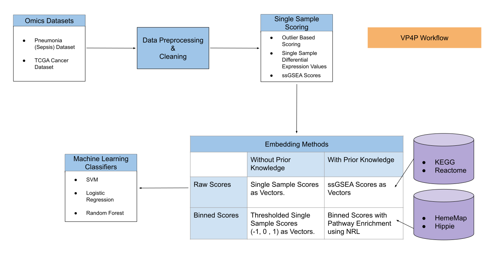

VP4P - Vectorization of Patients for Prediction
===============================================

The goal of this project is to:
1. Build a workflow to pre-process the gene expression data, and, 
2. Convert the expression data into a vector for prediction using various techniques

Datasets
--------
Datasets currently used in this repo

| Number | Dataset | Sepsis Patients  | Controls  |
| --| -------------:|:-------------:| -----:|
| #1 | [GSE48080](https://www.ncbi.nlm.nih.gov/geo/query/acc.cgi?acc=GSE48080) | 20 | 3 |
| #2 | [E-MTAB-5273](https://www.ebi.ac.uk/arrayexpress/experiments/E-MTAB-5273/) | 221 | 10 |
| #3 | [GSE65682](https://www.ncbi.nlm.nih.gov/geo/query/acc.cgi?acc=GSE65682) | 192 | 33 |

Workflow
--------

